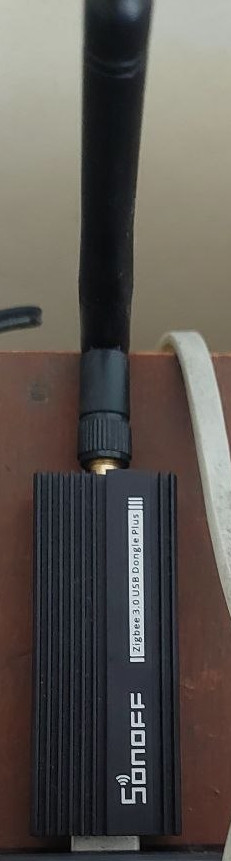
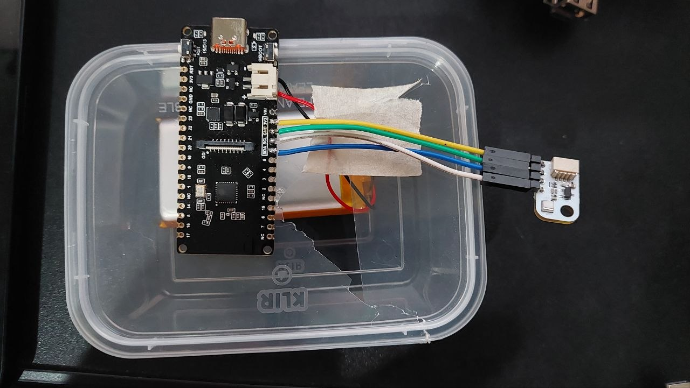

# mqtt

## requirements

SONOFF Zigbee 3.0 USB Dongle Plus ZBDongle-P



esp32c6 (mine is firebeetle 2 esp32c6) and aht20-f



## mqtt setup

- https://randomnerdtutorials.com/how-to-install-mosquitto-broker-on-raspberry-pi/
- https://randomnerdtutorials.com/testing-mosquitto-broker-and-client-on-raspbbery-pi/

```shell
sudo apt install -y mosquitto mosquitto-clients
sudo systemctl enable mosquitto.service
systemctl status mosquitto
sudo apt install libmosquitto-dev
sudo apt install -y mosquitto-dev
sudo systemctl stop mosquitto
sudo /usr/sbin/mosquitto -v
sudo vim /etc/mosquitto/mosquitto.conf
sudo systemctl restart mosquitto
sudo mosquitto_passwd -c /etc/mosquitto/passwd fahmad
sudo chmod 0700 /etc/mosquitto/passwd
sudo vim /etc/mosquitto/mosquitto.conf
sudo chown mosquitto:mosquitto /etc/mosquitto/passwd
sudo chmod 600 /etc/mosquitto/passwd
sudo systemctl restart mosquitto
sudo systemctl status mosquitto
mosquitto_sub -d -t testTopic
```

## mqtt sub

```shell
mosquitto_sub -d -t testTopic
```

## mqtt pub

```shell
mosquitto_pub -h 192.168.68.116 -d -t testTopic -m "Hello world!" -u USERNAME -P PASSWORD
```

## zigbee

- https://www.zigbee2mqtt.io/guide/faq/
